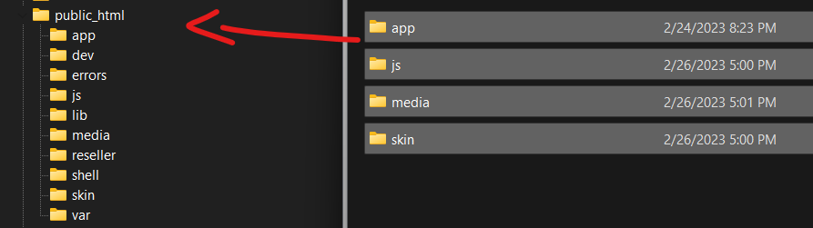
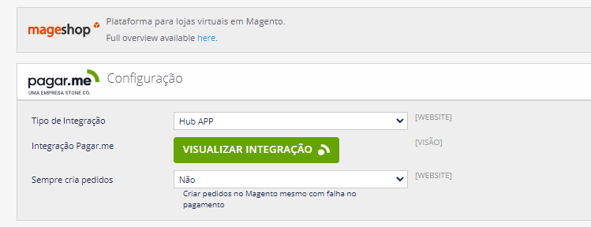

## Pagar.me + Mageshop
| |  |  |
| --- | --- | --- |


Extensão de pagamento Pagar.me para Magento Community 1.9.x.

## Compatibilidade

- Magento Community **1.9.x**
- PHP **7.4 — 8.3**
- API Pagar.me **v5** (integração HUB ou Manual)

## Requisitos

- Extensões PHP: `curl`, `json`, `openssl`, `mbstring`
- Permissão de escrita em `var/` e `media/`
- Cron do Magento configurado (necessário para processamento de webhooks)

## Métodos de pagamento suportados

| Método | Capturar | Estornar | Cancelar | Parcelas | Juros | Desconto | Antifraude |
|--------|----------|----------|----------|----------|-------|----------|------------|
| Cartão de Crédito | ✅ | ✅ | ✅ | até 18x | ✅ | ✅ | ✅ |
| Pix               | —  | —  | ✅ | —       | —    | —       | —          |
| Boleto            | —  | —  | ✅ | —       | —    | —       | —          |

## Tipos de integração

### HUB (recomendado)

Integração automática via OAuth pelo dashboard do Pagar.me. Não exige inserir chaves
manualmente.

- No admin do Magento, vá em **Sistema > Configuração > Métodos de Pagamento > Pagar.me Configuração**
- Em **Tipo de Integração**, selecione **Integração automática**
- Clique no botão **Conectar com Pagar.me** e siga o fluxo de autorização

### Manual (API v5)

Use suas chaves obtidas no dashboard Pagar.me em **Configurações > Chaves de API**.

- Em **Tipo de Integração**, selecione **Integração manual**
- Cole a **Secret Key** (`sk_...`)
- Cole a **Public Key** (`pk_...`)

> ⚠️ A Secret Key é criptografada ao salvar e o campo exibe asteriscos. Sempre cole
> a chave **completa** do dashboard — não tente editar os asteriscos.

## Como instalar a extensão

### 1° Baixar arquivos
- Adicione os arquivos dentro do repositório público da sua loja Magento 1.9



### 2° Atualizar o Cache

#### Acesse:
- Sistema > Gerenciamento de Cache > Selecionar Todos > Ação = Atualizar > Enviar
- Faça logout
- Login novamente

### 3° Configurar o Pagamento

#### Acesse:
- Sistema > Configuração > Método de Pagamento > Pagarme Configuração



## Webhook

O módulo expõe a URL abaixo para receber notificações da Pagar.me:

```
https://seu-dominio.com/pagarme/api/event
```

- **HUB:** webhook configurado automaticamente
- **Manual:** copie a URL acima e cole em **Configurações > Webhooks** no dashboard Pagar.me

As notificações são processadas pelo cron `mageshop_pagarme_jobs` (executa a cada minuto).
Confirme que o cron do Magento está rodando.

## Troubleshooting

### `Authorization has been denied for this request`
Mensagem literal da API Pagar.me indicando Secret Key inválida. Verifique:

1. Se você colou a Secret Key inteira (`sk_...`), não a Public Key
2. Se a chave é do ambiente correto (live x sandbox)
3. Se ao salvar o campo passou a exibir asteriscos (sinal que foi criptografada)

### Pedido Pix sem QR Code ou erro de validação no checkout
Pix exige obrigatoriamente `name`, `email`, `document` e `phones` do cliente.
Verifique se o seu checkout (especialmente OneStepCheckout de terceiros) está
preenchendo o telefone do comprador.

### Pedidos não atualizam de "Pending" após pagamento
1. Confirme que o webhook está configurado corretamente no Pagar.me
2. Confirme que o cron do Magento está rodando: `crontab -l`
3. Inspecione a tabela `mageshop_pagarme_jobs` — entradas com `attempts >= 3` indicam
   falhas; o motivo está na coluna `obs`

### CPF/CNPJ inválido
O módulo valida o documento antes de enviar à Pagar.me. Confirme que o campo de
documento do checkout está preenchido com 11 (CPF) ou 14 (CNPJ) dígitos válidos.

## Como contribuir

1. Faça um fork deste repositório
2. Crie uma nova branch: `git checkout -b minha-nova-feature`
3. Faça as alterações desejadas no código
4. Faça o commit das suas alterações: `git commit -m 'Adiciona nova feature'`
5. Faça o push para o repositório remoto: `git push origin minha-nova-feature`
6. Envie um Pull Request

## Suporte

- 🐛 Encontrou um bug? [Abra uma issue](../../issues/new)
- 💡 Sugestão de melhoria? Use [Discussions](../../discussions) ou abra uma issue
